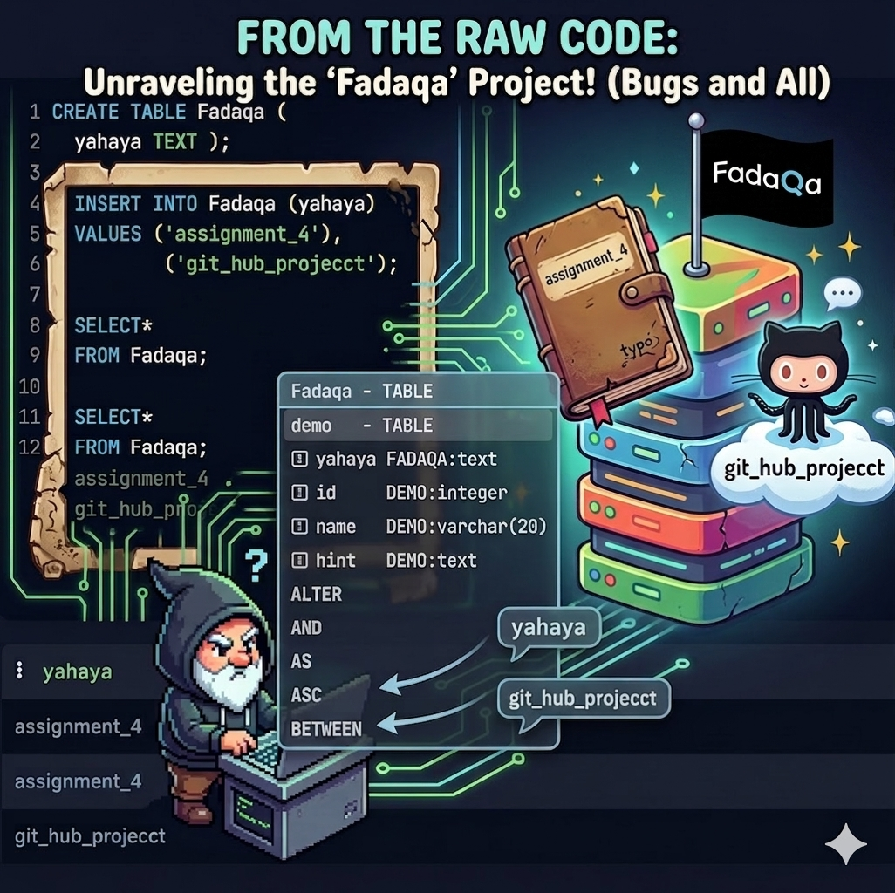
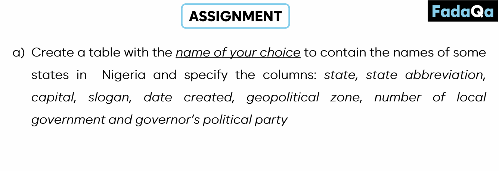
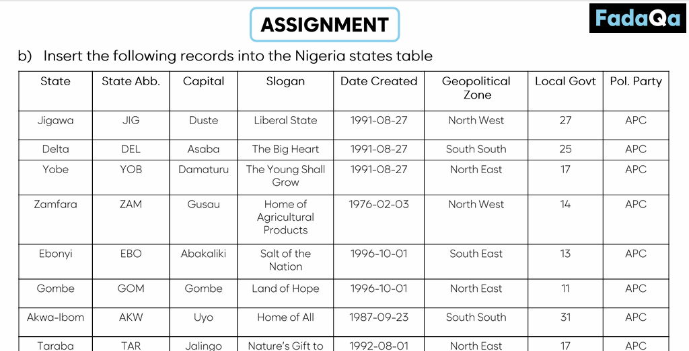
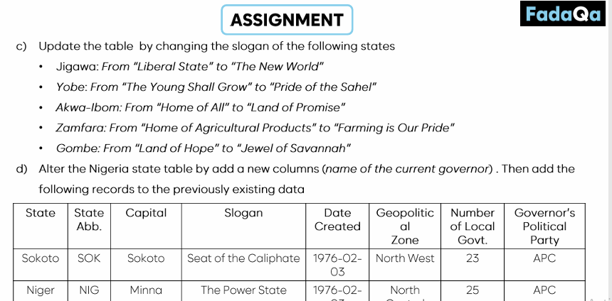
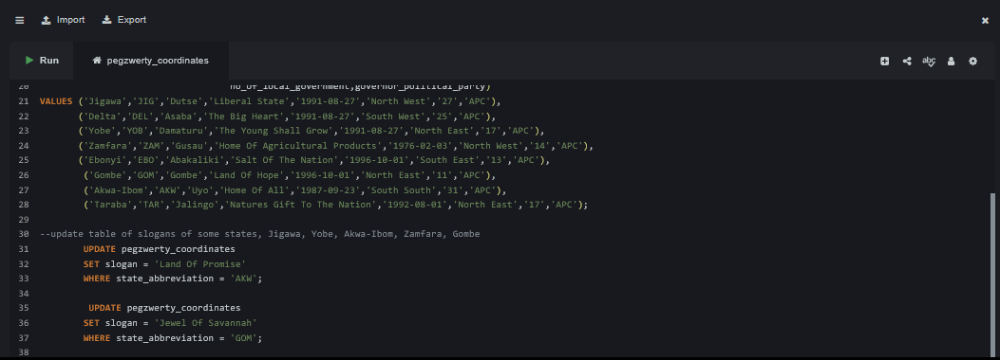
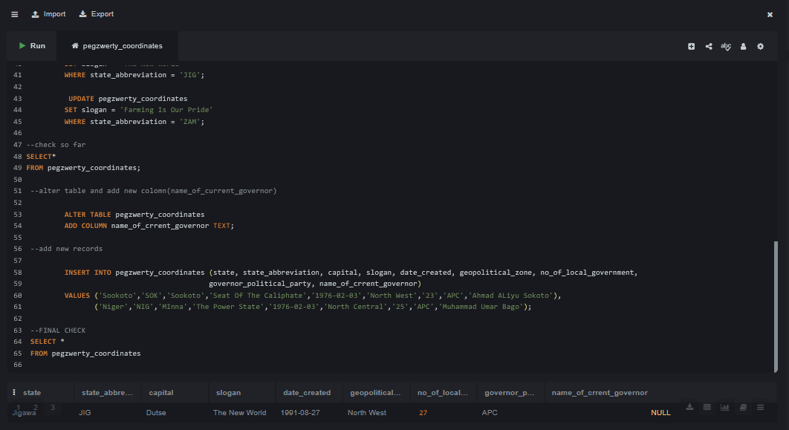
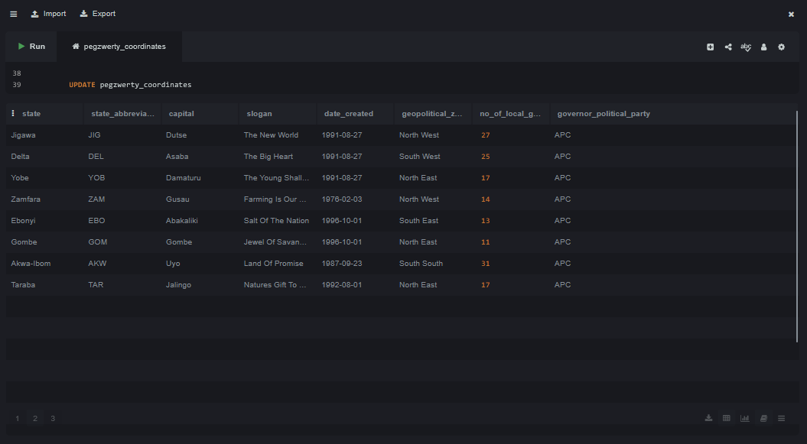
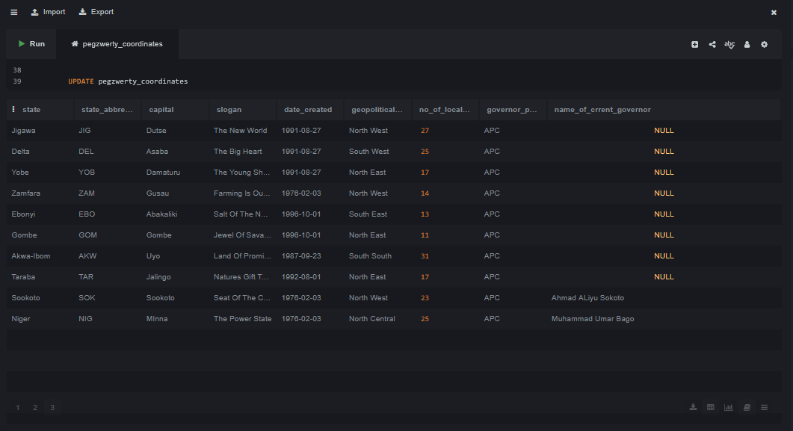

# Fadaqa_Assignment_4_Conclusion
A Test Of Skill Progress

## About Assignment
An SQL assignment focused on some fundamental Database Management System (DBMS) operations using a dataset of some Nigerian states. Here is a brief summary of the technical tasks solved

## Data Definition 
The assignment required creating a structured table with specific data types for geographic and political attributes, such as state names, abbreviations, capitals, and geopolitical zones. It also included structural modifications, such as altering the table to add new columns for governor information.

## Data Manipulation & Visualization
Insertion: Populating the database with specific records for multiple states, including historical creation dates and political party affiliations.

Updates: Modifying existing records to reflect new state slogans (e.g., updating Jigawa from "Liberal State" to "The New World").  

Data Integrity: The tasks demonstrate proficiency in maintaining accurate records through standard INSERT, UPDATE, and ALTER commands to ensure the database remains current with regional political changes.

### Step by step Graphical presentation of SQLite INPUTS And EXECUTIONS.

## Conclusion
Communication and Comprehension achieved through careful directives and guidance. 
